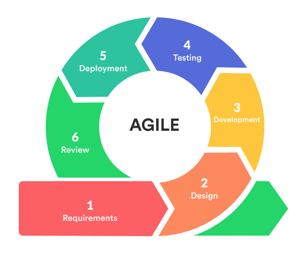

# Ohjelmistoprojekti 2

Tervetuloa Ohjelmistoprojekti 2 -kurssille! 👋

---

# Kurssista

- Kurssilla toteutetaan ryhmätyönä ohjelmistoprojekti ryhmäläisten muodostamasta aiheesta
- Projekti etenee kolmen viikon iteraatioissa kahden opetusperiodin ajan
- Jokaisen iteraation aluksi ryhmäläiset suunnittelevat iteraation aikana ohjelmistoon toteutettavat toiminallisuudet
- Iteraation aikana ryhmäläiset toteuttavat suunnitteltuja toiminallisuuksia itsenäisesti sekä opettajan ohjauksessa
- Iteraation päätteeksi ryhmäläiset esittelevät opettajalle projektin edistymistä ja saavat palautetta
- Opetusta järjestetään viikottain. Lisätietoa opetustilaisuuksista löytyy kurssisivulta

---

# Arviointi

- Kurssin arviointi perustuu seuraaviin tekijöihin:
  - Ryhmätyöskentelyn sujuvuuteen
  - Ryhmän lopullisen tuloksen tarkoituksenmukaiseen toimivuuteen
  - Kurssin lopuksi yksilötyönä tehtävään loppuraporttiin, jossa arvioidaan omaa ja ryhmän toimintaa
- Arvioinnin tukena käytetään kurssin aikana tehtävää itseis- ja vertaisarviointia

---

# Ketterä ohjelmistokehitys ja Scrum

---

# Ketterä ohjelmistokehitys

- Ohjelmistoprojekteissa toteutaan ohjelmistoja, jotka perustuvat johonkin tarpeeseen, jonka määrittelee ohjelmistoprojektin asiakas
- Ohjelmistokehittäjien tehtävä on muodostaa asiakkaan tarpeista toteuttamiskelpoisia teknisiä vaatimuksia ja toteuttaa ne sopivilla teknologioilla
- Tarpeiden selvittäminen vaatii jatkuvaa suoraa viestintää asiakkaan kanssa. Tarpeilla on myös tapana muuttua ja tarkentua ohjelmistoprojektin edetessä
- Ohjelmistotuotannossa sovelletaan nykyisin laajalti nk. _ketteriä menetelmiä_, jotka korostavat mm. suoraa viestintää sidosryhmien kanssa ja nopeaa muutoksiin reagointia
- Ketterät menetelmät ovat vaihtoehto perinteisille vaiheellisille ohjelmistotuotantoprosesesseille, kuten vesiputousmalli

---

# Ketterät menetelmät

> _"Kevyesti, joustavasti, notkeasti liikkuva, sukkela, vikkelä."_
>
> ⎯ Sanakirjan määritelmä sanalle _"ketterä"_

- Ketterien menetelmille tyypillistä on, että ohjelmistoa kehitetään lyhyissä iteraatioissa
- Jokaisen iteraation aikana suoritetaan kaikki ohjelmiston elinkaareen vaiheet vaatimusmäärittelystä tuotantoonvientiin

---

# Scrum

- Kurssin ohjelmistoprojektin projektinhallinnassa noudatetaan ketteriä menetelmiä soveltavaa _Scrum_-viitekehystä
- Scrum määrittelee ohjelmistokehitykselle iteratiivisen prosessin, joka etenee tyypillisesti 1-4 viikon iteraatioissa, joita kutsutaan _sprinteiksi_
- Sprintin aikana ohjelmistoon tuotetaan inkrementaalisesti uutta julkaisukelpoista toiminallisuutta
- Kurssilla sprintin pituus on kolme viikkoa

---

# Scrumin roolit

- Ohjelmistoprojektista vastaa _Scrum-tiimi_, jossa on kolme erilaista roolia
- Ohjelmiston toteutuksesta vastaa _kehittäjätiimi_, joka koostuu 3-9 ohjelmistokehittäjästä
  - Sprintin aikana kehittäjätiimi toteuttaa itseorganisoidusti sprinttiin valitut ohjelmiston toiminnallisuudet
- _Scrum master_ on usein kehittäjätiimin jäsen, joka toimii sen apuna ohjaten mm. prosessin noudattamisessa ja parantamisessa
- _Tuoteomistaja_ (product owner) määrittelee ja priorisoi kehittäjätiimin työtä
  - Hallinnoi projektin _product backlogia_, joka sisältää priorisoidussa järjestyksessä projektissa toteutettavalle ohjelmistolle asetetut vaatimukset

---

# Scrumin tapahtumat

- Scrumissa käytetään ennaltasovittuja tapahtumia, jotka toistuvat jokaisessa sprintissä
- Sprintti alkaa _sprintin suunnittelulla_ (sprint planning), jonka aikana päätetään mitä toiminallisuutta sprintin aikana toteutetaan
- Sprintin aikana järjestetään lyhyitä kehittäjätiimin sisäisiä _päiväpalavereja_ (daily scrum), joissa jokainen tiimin jäsen kertoo vuorallaan, miten kehitystyö etenee
- Sprintti päättyy _sprinttikatselmukseen_ (sprint review), jonka aikana kehittäjätiimi esittelee sprintin aikana toteutetut toiminallisuudet kaikille kehitettävästä tuotteesta kiinnostuneille sidosryhmille
- Sprintin päätteeksi järjestetään _retrospektiivi_, jossa kehittäjätiimi tarkastelee Scrum masterin johdolla omaa työskentelyprosessiaan ja pyrkivät kehittämään sitä

---

---

# Ryhmäytyminen ja aiheen ideointi

---

# Aloitetaan työskentely ryhmissä

1. Jakaudutaan noin 4-5 hengen ryhmiin
2. Tehkää ryhmän sisällä lyhyt esittelykierros. Jokainen voi kertoa vuorollaan esimerkiksi:
   - Minkälainen tausta on opinnoissa tai mahdollisesti työelämässä
   - Mitkä ovat omat kiinnostuksen kohteet ohjelmistokehityksessä?
   - Mitkä ovat omat vahvuusalueet ohjelmointikielissä, tai muissa toteutusteknologioissa?
   - Mitä odotuksia on kurssin suhteen?
3. Valitkaa tiimillenne nimi
4. Alkakaa ideoimaan yhdessä ohjelmistoprojektin aihetta

---

# Aiheen valinta ja rajaus

- Projektissa ei välttämättä ole ulkoista tuoteomistajaa, vaan tiimi toimii itse tuoteomistajan roolissa
- Tiimi joutuu tällöin itse määrittelemään projektin vaatimuksia ja priorisoimaan niitä
- Aiheen ideoinnissa voi lähteä liikkeelle laajasta ideasta, kuten "kurssiarvostelu-sovellus", tai "sanaston harjoittelu -peli"
- Tämän jälkeen laajasta ideasta voi muodostaa konkreettisia toiminallisuuksia priorisoiden käyttäjän kannalta tärkeimpiä toiminallisuuksia
- Aluksi kannattaa tähdätä _Minimum Viable Product_ (MVP) -toteutukseen, josta toiminallisuutta voi lähteä laajentamaan
- Yksinkertainen ja toimiva sovellus on käyttäjän kannalta mielekkäämpi kuin suuret ja yksityiskohtaiset suunnitelmat hienosta sovelluksesta, jota ei koskaan ehditty toteuttaa

---

# Aiheen valinta ja rajaus

> _"Keep it simple, stupid!"_
>
> ⎯ KISS-periaate
