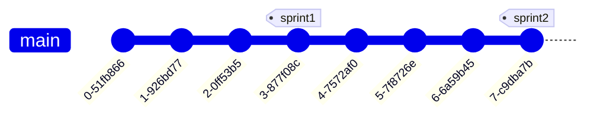

# Sprint 1

Sprintin tavoitteet projektille:

- Sprintille on määritelty ja valittu user storyt, jotka löytyvät sprint backlogista.
- Sprint backlog on pidetty ajantasalla koko sprintin ajan ja sitä on hyödynnetty sprintin edistymisen seuraamiseen.
- Versionhallinnassa on käytetty päähaarasta erillistä kehityshaaraa. Valmis toiminallisuus on yhdistetty repositorion päähaaraan, eikä päähaarassa ole keskeneräistä koodia.
- Suunnitellut user storyt on pääosin toteutettu sprintin aikana.
- Sprintille on tehty GitHub release.
- Sprintin katselmointia varten on valmisteltu lyhyt demo sprintin aikana toteutetuista toiminallisuuksista.

## Viikko 1

- Valitkaa sprintille [scrum master](https://www.scrum.org/resources/what-is-a-scrum-master).
- Viimeistelkää sprint backlog sprintin aloitusta varten.
- Päättäkää sprintin alustavasta työnjaosta ja alkakaa toteuttamaan user storyja. Pitäkää sprint backlog ajantasalla koko sprintin ajan ja hyödyntäkää sitä sprintin edistymisen seuraamisessa.
- Kerratkaa tarvittaessa versionhallinnan ja Git:in käyttöä esimerkiksi [tämän](https://tkt-lapio.github.io/git/) materiaalin avulla.

## Viikko 2

- Pitäkää ensimmäinen [daily scrum](https://www.mountaingoatsoftware.com/agile/scrum/meetings/daily-scrum) -palaveri, jossa seuraatte sprintin edistymistä. Hyödyntäkää tapaamisessa sprint backlogia. Aloittakaa jatkossa jokainen tiimin tapaaminen daily scrum -palaverilla.
- Lukekaa [Git branching](https://git-scm.com/book/en/v2/Git-Branching-Basic-Branching-and-Merging) ja [Git feature branch workflow](https://www.atlassian.com/git/tutorials/comparing-workflows/feature-branch-workflow) -ohjeet.
- Toteuttakaa ainakin joitain toiminallisuuksia erillisissä feature-haaroissa. Yhdistäkää feature-haarat päähaaraan [pull requestin](https://docs.github.com/en/pull-requests/collaborating-with-pull-requests/proposing-changes-to-your-work-with-pull-requests/creating-a-pull-request) avulla. Jos haarassa on konflikteja päähaaraan kanssa, ne voi ratkaista [tämän](https://docs.github.com/en/pull-requests/collaborating-with-pull-requests/addressing-merge-conflicts/resolving-a-merge-conflict-on-github) ohjeen mukaisesti. _Pitäkää feature-haarojen muutokset pieninä_ (max. yhden user storyn toteutus) ja _yhdistäkää ne päähaaraan, kun toteutus on valmis_. Näin vältetään nk. ["Merge hell"](https://threkk.medium.com/escaping-a-git-merge-hell-e08f37511f37).
- Jatkakaa projektin edistämistä.

{: width="500" }

## Viikko 3

- Tehkää sprintin päätteeksi sprintille [GitHub release](https://docs.github.com/en/repositories/releasing-projects-on-github/managing-releases-in-a-repository). Releasen voi nimetä sprintin numeron perusteella, esim. "Sprint 1". Tehkää releasen yhteydessä commit-historiaan uusi [tagi](https://git-scm.com/book/en/v2/Git-Basics-Tagging), esim. "sprint1". Lisätkää releasen kuvaukseen lyhyt kuvaus sprintin aikana toteutetuista toiminallisuuksista.
- Valmistelkaa lyhyt demo sprintin tuotoksista sprintin katselmointia varten. Katselmointi pidetään opettajille ja kurssin muille tiimeille. Esitelkää tiiminne jäsenet, kertokaa lyhyesti projektistanne (mm. projektin tarkoitus, tärkemmäit toiminallisuudet, toteutuksessa hyödynnettävät teknologiat) ja esitelkää sprintin aikana toteutettu toiminallisuus.

