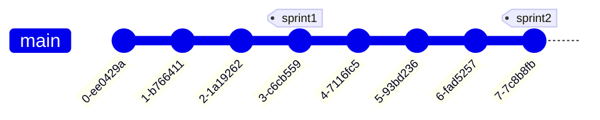

# Sprint 1

{: .warning }

> Koodin laajamittainen generointi generatiivisen tekoälyn työkaluilla (esim. ChatGPT, tai Copilot) on kiellettyä, ellei sen tekemistä erikseen ohjeisteta. Sprint review -tapaamisissa opettaja voi pyytää tiimiläisiä perustelemaan teknisiä ratkaisuja ja perustelujen laatu vaikuttaa arviointiin.  

Sprintin tavoitteet projektille:

- Sprintille on määritelty ja valittu user storyt, jotka löytyvät backlogista. User storyista on myös jossain määrin lisätty backlogille taskeja, jotka kuvaavat teknistä toteutusta, kuten _"REST API endpoint viestien listaamiselle"_. Työn alla olevista backlogin user storeista ja taskeista tulee käydä ilmi, kenen vastuulla ne ovat.
- Backlog on pidetty ajantasalla koko sprintin ajan ja sitä on hyödynnetty sprintin edistymisen seuraamiseen.
- Ainakin osa toiminnallisuudesta on kehitetty pääharasta erillään olevissa feature-haaroissa (enintään yhden user storyn laajuus haaraa kohden), jotka on mergattu päähaaraan toiminallisuuden valmistuttua.
- Sprintille on tehty GitHub release.
- Sprintin katselmointia varten on valmisteltu lyhyt demo sprintin aikana toteutetuista toiminallisuuksista.
- Fullstack-projektissa (frontend kutsuu backendin REST API -rajapintoja), voitte halutessanne toteuttaa [Token-pohjaisen autentikaation](https://medium.com/@extio/understanding-json-web-tokens-jwt-a-secure-approach-to-web-authentication-f551e8d66deb). [Esimerkkisovelluksesta](https://github.com/hh-ohjelmistoprojekti-2/spring-boot-vite-example/blob/main/authentication-flow.md) löytyy esimerkki frontend- ja backend-toteutuksesta.

## Viikko 1

- Valitkaa sprintille [scrum master](https://www.scrum.org/resources/what-is-a-scrum-master). Scrum master mm. valvoo, että projektin backlog pidetään ajan tasalla ja fasilitoi tiimin tapaamisia.
- Viimeistelkää backlog sprintin aloitusta varten user storyjen ja taskien osalta.
- Päättäkää sprintin alustavasta työnjaosta ja alkakaa toteuttamaan user storyja. Merkatkaa backlogille työn alla olevien user storien ja taskien tekijä(t). Pitäkää backlog ajantasalla koko sprintin ajan ja hyödyntäkää sitä sprintin edistymisen seuraamisessa.
- Kerratkaa tarvittaessa versionhallinnan ja Git:in käyttöä esimerkiksi [tämän](https://tkt-lapio.github.io/git/) materiaalin avulla.
- Alkakaa toteuttamaan backlogin user storyja.

## Viikko 2

- Pitäkää ensimmäinen [daily scrum](https://www.mountaingoatsoftware.com/agile/scrum/meetings/daily-scrum) -palaveri, jossa seuraatte sprintin edistymistä. Hyödyntäkää tapaamisessa backlogia. Aloittakaa jatkossa jokainen tiimin tapaaminen daily scrum -palaverilla.
- Lukekaa [Git branching](https://git-scm.com/book/en/v2/Git-Branching-Basic-Branching-and-Merging) ja [Git feature branch workflow](https://www.atlassian.com/git/tutorials/comparing-workflows/feature-branch-workflow) -ohjeet.
- Toteuttakaa ainakin joitain toiminallisuuksia erillisissä feature-haaroissa. Yhdistäkää feature-haarat päähaaraan [pull requestin](https://docs.github.com/en/pull-requests/collaborating-with-pull-requests/proposing-changes-to-your-work-with-pull-requests/creating-a-pull-request) avulla. Jos haarassa on konflikteja päähaaran kanssa, ne voi ratkaista [tämän](https://docs.github.com/en/pull-requests/collaborating-with-pull-requests/addressing-merge-conflicts/resolving-a-merge-conflict-on-github) ohjeen mukaisesti. _Pitäkää feature-haarojen muutokset pieninä_ (max. yhden user storyn toteutus) ja _yhdistäkää ne päähaaraan, kun toteutus on valmis_. Näin vältetään nk. ["Merge hell"](https://threkk.medium.com/escaping-a-git-merge-hell-e08f37511f37).
- Voitte halutessanne tehdä pull requesteissa jo [koodikatselmointeja](https://docs.github.com/en/pull-requests/collaborating-with-pull-requests/reviewing-changes-in-pull-requests/about-pull-request-reviews).

{: width="500" }

## Viikko 3

- Tehkää sprintin päätteeksi sprintille [GitHub release](https://docs.github.com/en/repositories/releasing-projects-on-github/managing-releases-in-a-repository). Releasen voi nimetä sprintin numeron perusteella, esim. "Sprint 1". Tehkää releasen yhteydessä commit-historiaan uusi [tagi](https://git-scm.com/book/en/v2/Git-Basics-Tagging), esim. "sprint1". Lisätkää releasen kuvaukseen lyhyt kuvaus sprintin aikana toteutetuista toiminallisuuksista.
- Valmistelkaa lyhyt demo sprintin tuotoksista sprintin katselmointia varten. Katselmointi pidetään opettajille ja kurssin muille tiimeille. Esitelkää tiiminne jäsenet, kertokaa lyhyesti projektistanne (mm. projektin tarkoitus, tärkeimmät toiminallisuudet, toteutuksessa hyödynnettävät teknologiat) ja esitelkää sprintin aikana toteutettu toiminallisuus.

